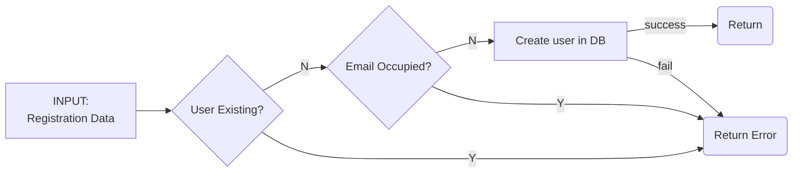
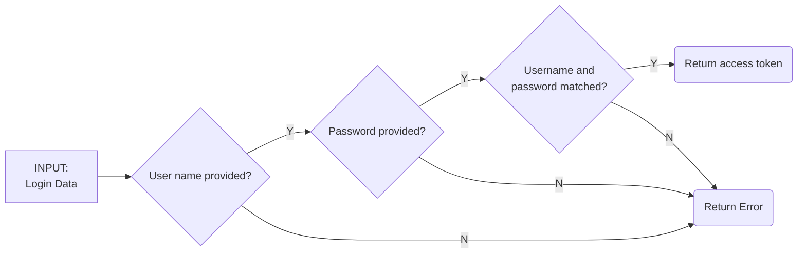

# Detail Design

1. Register API



2. Login API



# Specification (YAML)

```yaml
paths:
  /auth/register:
    post:
      description: |
        Register a new user.
      consumes:
        - application/json
      produces:
        - application/json
      parameters:
        - in: body
          name: body
          description: |
            Registration form values.
          required: true
      responses:
        200:
          description: >
            User would be redirected to login page.
        400:
          description: >
            Error occurred.
  /auth/login:
    post:
      description: |
        User login.
      consumes:
        - application/json
      produces:
        - application/json
      parameters:
        - in: body
          name: body
          description: |
            Login form values.
          required: true
      responses:
        200:
          description: >
            User would be redirected to home page.
        400:
          description: >
            Error occurred.

definitions:
  ErrorResponse:
    type: object
    properties:
      errorVerbose:
        type: string
  RegisterRequest:
    type: object
    properties:
      user_name: 
        type: string
      password:
        type: string
      email:
        type: string
  LoginRequest:
    type: object
    properties:
      user_name:
        type: string
      password:
        type: string  
```

# Request and Response Sample

1. register

  - Request

    ```
    curl POST \
      http:// {hostname}/auth/register \
      -H 'content-type: application/json' \
      -d '{
        "user_name": "Alice",
        "password": "098f6bcd4621d373cade4e832627b4f6",
        "email": "test@xxx.com"
      }'
    ```


2. login

  - Request

    ```
    curl POST \
      http:// {hostname}/auth/login \
      -H 'content-type: application/json' \
      -d '{
        "user_name": "Alice",
        "password": "098f6bcd4621d373cade4e832627b4f6"
      }'
    ```

  - Reponse

    ```json
    {
      "errorVerbose": "User name and/or password are wrong"
    }
    ```
